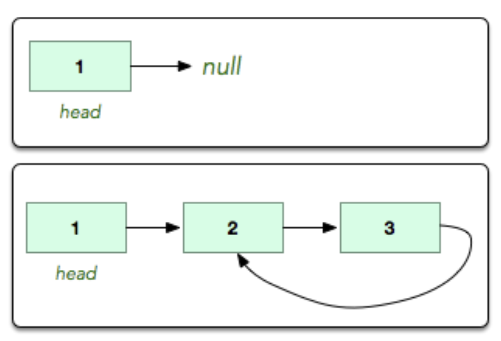

# Cycle Detection

## Problem

### Description

A linked list is said to contain a cycle if any node is visited more than once while traversing the list. Given a pointer to the head of a linked list, determine if it contains a cycle. If it does, return 1. Otherwise, return 0.

### Task

Complete the `hasCycle` function.

**Parameters**

- SinglyLinkedListNode pointer head: a reference to the head of the list

**Returns**

- int: 1 if there is a cycle or 0 if there is not

### Samples input/output



The first list has no cycle, so return 0.
The second list has a cycle, so return 1.

## Solution

```ts
'use strict';

const fs = require('fs');

process.stdin.resume();
process.stdin.setEncoding('utf-8');

let inputString: string = '';
let inputLines: string[] = [];
let currentLine: number = 0;

process.stdin.on('data', function(inputStdin: string): void {
    inputString += inputStdin;
});

process.stdin.on('end', function(): void {
    inputLines = inputString.replace(/\s*$/, '')
        .split('\n')
        .map(str => str.replace(/\s*$/, ''));
    main();
});

function readLine(): string {
    return inputLines[currentLine++];
}

class SinglyLinkedListNode {
    data: number;
    next: SinglyLinkedListNode | null;

    constructor(nodeData: number) {
        this.data = nodeData;
        this.next = null;
    }
}

class SinglyLinkedList {
    head: SinglyLinkedListNode | null;
    tail: SinglyLinkedListNode | null;

    constructor() {
        this.head = null;
        this.tail = null;
    }

    insertNode(nodeData: any): void {
        const node = new SinglyLinkedListNode(nodeData);

        if (this.head === null) {
            this.head = node;
        } else {
            if (this.tail !== null) {
                this.tail.next = node;
            }
        }

        this.tail = node;
    }
}

/* 
   A linked list is said to contain a cycle if any node is visited more than once while traversing the list 
   @function hasycle
   @param {SinglyLinkedList} A pointer to the head of a linked list
   @returns {number} 1 if it contains a cycle, otherwise return 0
*/
function hasCycle(head: SinglyLinkedListNode): number {
    // Case `null` is covered by the loop condition;
    // if (head === null) {
    //     return 0;
    // }

    let slow = head;
    let fast = head;

    while(fast !== null && fast.next !== null) {
        slow = slow.next;
        fast = fast.next.next;

        if (slow === fast) {
            return 1;
        }
    }

    return 0;
}

function main() {
    // @ts-ignore
    const ws = fs.createWriteStream(process.env.OUTPUT_PATH);

    const tests = parseInt(readLine(), 10);

    for (let testsItr = 0; testsItr < tests; testsItr++) {
        const index = parseInt(readLine(), 10);

        const llistCount = parseInt(readLine(), 10);

        let llist = new SinglyLinkedList();

        for (let i = 0; i < llistCount; i++) {
            const llistItem = parseInt(readLine(), 10);
            llist.insertNode(llistItem);
        }
      
        let extra = new SinglyLinkedListNode(-1);
        let temp = llist.head;

        for (let i = 0; i < llistCount; i++) {
              if (i == index) {
                extra = temp;
              }

              if (i != llistCount-1) {
                temp = temp.next;
              }
        }

        temp.next = extra;

        let result = hasCycle(llist.head);

        ws.write((result ? 1 : 0) + "\n");
    }

    ws.end();
}
```

## Thougths

Time Complexity:
O(N)

[Editorial](https://www.hackerrank.com/challenges/detect-whether-a-linked-list-contains-a-cycle/editorial)

See [Cycle detection](https://en.wikipedia.org/wiki/Cycle_detection#Floyd's_tortoise_and_hare).
> At each step of the algorithm, it increases *i* by one, moving the tortoise one step forward and the hare two steps forward in the sequence, and then compares the sequence values at these two pointers.
